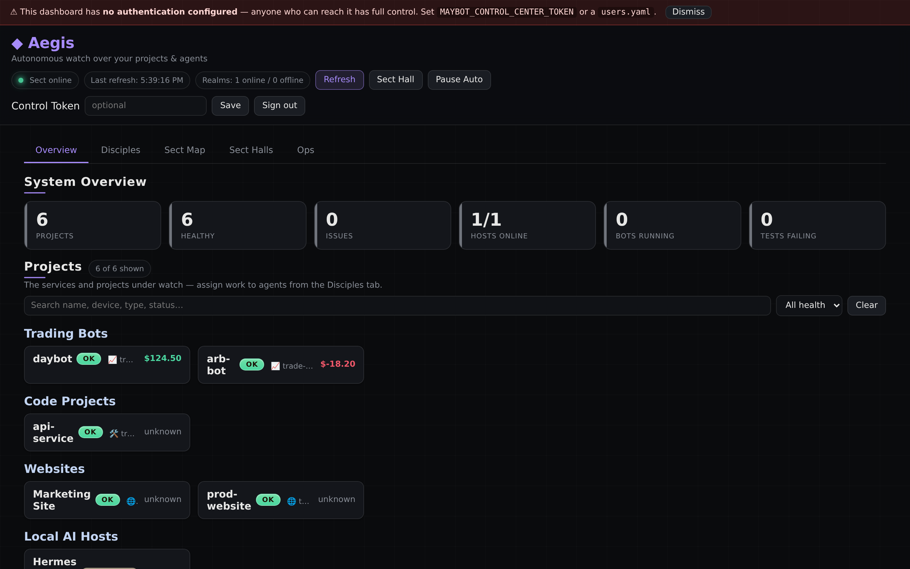

# Control center setup (the dashboard host)

This guide covers the **dashboard side** — installing, securing, and running
`maybot_control_center`, the central web app that polls your agent hosts and
shows the unified view. (For the bot-host side see
[AGENT_SETUP.md](AGENT_SETUP.md); for the LLM that powers the agents see
[LOCAL_AI_SETUP.md](LOCAL_AI_SETUP.md).)

> Fastest path: the [desktop app](DESKTOP_APP.md) installs a clickable launcher
> that does all of this with Docker. This page is the manual / reference version
> and explains the moving parts.

---

## 1. Install

```bash
git clone <your-repo-url> maybot && cd maybot
cp .env.example .env          # auto-loaded by docker compose; the control center's config
```

The control center needs Python 3.10+ if you run it without Docker
(`pip install -r requirements.txt`). With Docker, nothing else is required.

---

## 2. Configure

Two files and one env file drive the dashboard:

| File | Purpose | Reference |
|---|---|---|
| `.env` | All runtime settings & secrets (auto-loaded by compose) | `.env.example` |
| `devices.yaml` | The agent hosts to pull from | `devices.yaml.example`, [AGENT_SETUP.md](AGENT_SETUP.md) |
| `users.yaml` *(optional)* | Per-user roles + per-project ACLs | `users.yaml.example` |
| `agents.yaml` *(optional)* | The LLM "disciples" | [LOCAL_AI_SETUP.md](LOCAL_AI_SETUP.md) |

### Minimum secrets in `.env`
```bash
# Generate:  python3 -c "import secrets; print(secrets.token_hex(32))"
MAYBOT_CONTROL_CENTER_TOKEN=<long-random-secret>   # dashboard login; set before any network exposure
ANTHROPIC_API_KEY=<key>                            # only if you use Claude-backed disciples
```

### Tell it which hosts to poll — `devices.yaml`
```yaml
devices:
  - name: trade-server
    url: http://100.64.0.2:8100        # the agent host's reachable IP + port
    api_token: "must-match-that-hosts-MAYBOT_API_TOKEN"
```
See [AGENT_SETUP.md](AGENT_SETUP.md) for the host side and `scripts/check-agent.sh`
to verify each link.

---

## 3. Run

Pick one:

**A — Desktop app (recommended):** see [DESKTOP_APP.md](DESKTOP_APP.md). One click, auto-restarts.

**B — Docker Compose:**
```bash
docker compose up -d            # dashboard on http://localhost:8200, co-located agent on :8100
docker compose logs -f control-center
```
Ships with every feature on by default and `restart: unless-stopped` (survives crashes/reboots).

**C — Bare uvicorn (no Docker):**
```bash
python3 -m venv .venv && source .venv/bin/activate
pip install -r requirements.txt
export MAYBOT_CONTROL_CENTER_TOKEN=...           # and any other vars from .env
export MAYBOT_DB=./maybot.db                     # optional persistence
uvicorn maybot_control_center.app:app --host 0.0.0.0 --port 8200
```
> `.env` is **not** auto-loaded outside Docker — export the vars yourself, or use a `systemd` unit (template in the [README](../README.md#keep-agents-running-with-systemd-recommended)) with `EnvironmentFile=`.

Then open **http://localhost:8200** and sign in with `MAYBOT_CONTROL_CENTER_TOKEN`.

---

## 4. Access control (optional but recommended)

Without `users.yaml`, the single `MAYBOT_CONTROL_CENTER_TOKEN` grants full operator
access (or open access if unset). For multiple people / least privilege, add
`users.yaml` (see `users.yaml.example`):

```yaml
users:
  - name: alice
    token: "<secret>"
    role: operator              # read + mutate (actions, tasks, tools)
  - name: bob
    token: "<secret>"
    role: viewer                # read-only
    projects: ["edge-pi:*"]     # optional per-project ACL (device:project, wildcards ok)
```

- **Login → session token:** `POST /api/login` exchanges a token for a time-boxed
  session (TTL `MAYBOT_SESSION_TTL_MINUTES`, default 720); `POST /api/logout` revokes it.
- **Rate limiting:** `MAYBOT_RATE_LIMIT` / `MAYBOT_RATE_WINDOW`.

---

## 5. Verify it's healthy

```bash
curl -s http://localhost:8200/healthz          # liveness  -> {"status":"ok"}
curl -s http://localhost:8200/readyz           # readiness (device poll freshness)
curl -s http://localhost:8200/metrics | head   # Prometheus metrics
curl -s -H "X-Control-Token: $TOKEN" http://localhost:8200/api/selfcheck   # poll age, request/error counts
```

In the UI you should see your `devices.yaml` hosts and their projects populate
within one poll. If a device shows offline/auth-error, run
`scripts/check-agent.sh <url> <token>` (see [AGENT_SETUP.md](AGENT_SETUP.md)).



---

## 6. Turn features on/off

The control center ships with everything enabled via `docker-compose.yml` +
`.env.example`. Toggle in `.env` (full list/defaults documented there and in the
[README "Capability upgrades"](../README.md#capability-upgrades) section):

| Area | Key vars |
|---|---|
| Persistence / retention / backups | `MAYBOT_DB`, `MAYBOT_RETENTION_DAYS`, `MAYBOT_BACKUP_DIR` |
| Daily summary report | `MAYBOT_REPORT_INTERVAL_HOURS` |
| Notifications | `MAYBOT_SLACK_WEBHOOK`, `MAYBOT_SMTP_*`, `MAYBOT_TELEGRAM_*` |
| Autonomous ops ⚠️ | `MAYBOT_AUTOPILOT`, `MAYBOT_AUTONOMY`, `MAYBOT_DELEGATION`, `MAYBOT_PR_ENABLED` |
| Public status page | `MAYBOT_PUBLIC_STATUS` (off by default) |

> ⚠️ With the autonomous tier on, the dashboard can restart/stop live bots, auto-run
> guarded tools, and open real PRs. Set any of those to `0` to dial back.

---

## Troubleshooting

| Symptom | Fix |
|---|---|
| Dashboard loads but is empty | `devices.yaml` has no reachable hosts — verify with `scripts/check-agent.sh`. |
| "invalid control token" on login | Token doesn't match `MAYBOT_CONTROL_CENTER_TOKEN` (or `users.yaml`). |
| Device shows **offline / auth error** | Agent unreachable or `api_token` mismatch — see [AGENT_SETUP.md](AGENT_SETUP.md). |
| History/sparklines reset on restart | Set `MAYBOT_DB` to persist (it's a path; in Docker it's `/data/maybot.db`). |
| Disciples don't reply | Configure an LLM backend — [LOCAL_AI_SETUP.md](LOCAL_AI_SETUP.md). |
| `/readyz` returns 503 | A polled device is offline (use `?strict=0` to relax, or fix the device). |

Related: [DESKTOP_APP.md](DESKTOP_APP.md) · [AGENT_SETUP.md](AGENT_SETUP.md) · [LOCAL_AI_SETUP.md](LOCAL_AI_SETUP.md)
